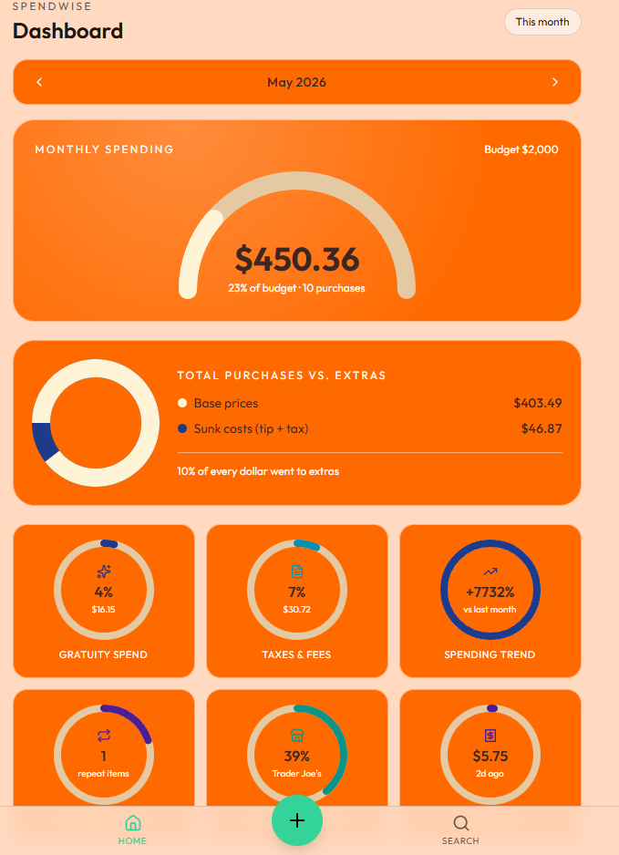
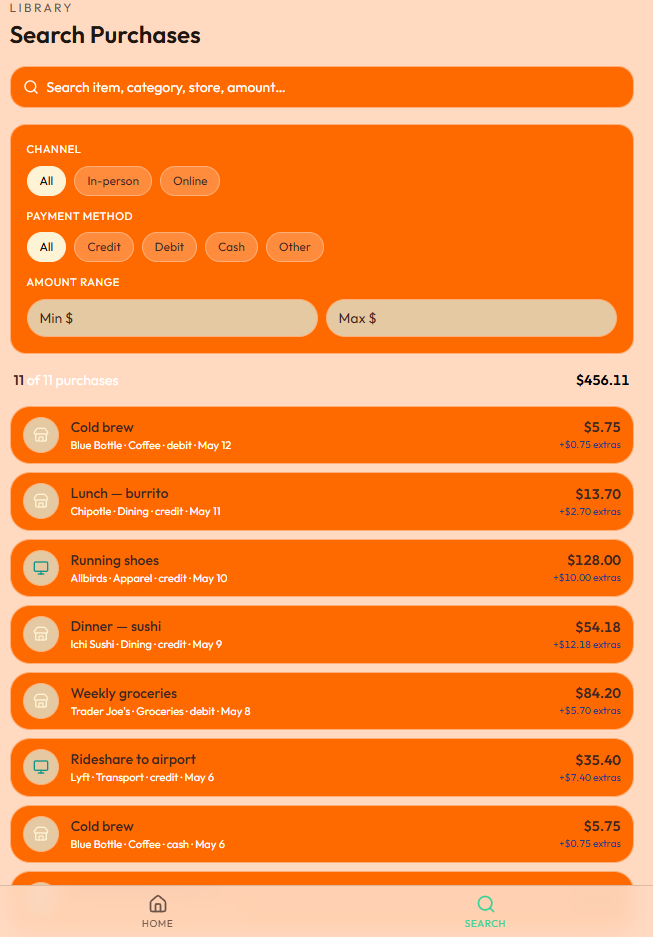
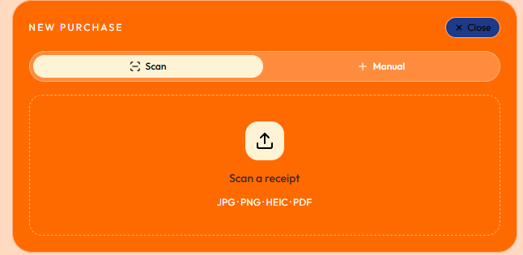

# MIS 15: Vibe Coding Final Report – SpendWise

**Date:** May 13, 2026  
**Team Members:** Sabal Dhoj Adhikary, Aaliyah Minnie  

## Project Links

- [Live App: SpendWise on Replit](https://spend-wise-sabaladhikary-aaliyahminnie.replit.app/)
- [README](README.md)

---

# 1. Executive Summary

SpendWise is a personal finance dashboard that helps users catalog purchases and understand their spending habits. Users can manually enter purchases or upload receipts, and the app provides insights such as total spending, tip percentage, taxes, fees, and monthly spending trends

The goal of SpendWise is to help users understand not only where their money is going, but also how much extra they are paying above the base price of their purchases.

---

# 2. The Problem and Target Audience

## The Problem

In a service-heavy economy, the advertised “base price” is often not the final price. Consumers usually focus on the final total but lose track of the cumulative impact of service charges, taxes, tips, delivery fees, and gratuity.

This creates an information gap. Users may know they spent `$25`, but they may not realize how much of that total came from the original item and how much came from extra charges. Over time, these small costs can create financial leakage in everyday transactions.

SpendWise solves this problem by breaking every purchase into clearer components:

- base price
- tips or gratuity
- taxes
- service fees
- total amount
- friction costs

This gives users a more honest view of what they are actually paying.

## Target User

SpendWise is designed for students, young adults, and gig-economy consumers who want a simple way to audit their spending habits without the complexity of a full-scale accounting or budgeting app.

Our target user is someone who wants to understand where their money is going, especially when small extra charges begin to add up over time.

---

# 3. Why SpendWise Is Unique

SpendWise is unique because it focuses on **how much extra** users are paying above the base price, not just where they are spending.

Many finance apps focus on broad categories such as food, shopping, bills, or transportation. SpendWise focuses specifically on the hidden “last-mile” costs of modern spending, such as:

- tips and gratuity
- taxes
- service fees
- delivery fees
- recurring small purchases
- extra charges above the base price

This makes SpendWise a specialized tool for users who want to understand the real cost behind their purchases.

---

# 4. Development Process: The Vibe Coding Lifecycle

We used Replit’s AI-powered environment to move from idea to a functional prototype. The process followed the **Vibe Coding lifecycle**:

1. **Idea Creation**: We identified the problem of receipt blindness and hidden spending costs.
2. **Generation**: We used AI tools to generate the first working version of the app.
3. **Iterative Refinement**: We tested the app and gave more specific prompts to improve it.
4. **Testing and Validation**: We checked the dashboard, purchase entries, receipt upload, and search features.
5. **Deployment**: We finalized the app in Replit and created documentation through the README and final report.

The first version gave us a starting point, but the real work came from testing, refining, and shaping the app into something useful and understandable.

---

# 5. Initial High-Level Prompt

Our initial prompt was similar to this:

```text
Build a finance dashboard called SpendWise.

SpendWise should allow users to manually enter purchase information or upload a receipt image. The app should catalog purchases and display insights such as total spending, base price, tips, gratuity percentage, taxes, fees, monthly spending trends, recurring costs, and frequent vendors.

The dashboard should focus on extra costs like service fees, taxes, and gratuity so users can understand how much they are paying above the base price of their purchases.
```

---

# 6. Iterative Refinement: “The Vibe Shift”

The most important part of the project was not the first AI-generated version. The most important part was refining the app through specific prompts and testing.

| Prompt / Refinement | Why We Sent It | Result |
|---|---|---|
| “Separate base purchase prices from tips, taxes, and fees.” | The first version focused too much on total spending. Our app needed to expose hidden costs. | SpendWise became more focused on friction costs instead of only transaction totals. |
| “Add a calculation that compares this month’s extra costs to the user’s monthly spending.” | Seeing a single number is useful, but users also need context to understand their habits. | The dashboard became more useful for identifying spending patterns. |
| “Add a dashboard card for Total Purchases vs. Extras.” | We wanted users to quickly compare normal purchase costs against extra costs. | The dashboard became more visual and easier to understand. |
| “Add receipt upload so users can scan a receipt instead of typing everything manually.” | Manual entry is useful, but receipt upload makes the app faster and more realistic. | The app gained a smarter input method for purchase data. |
| “Refine the receipt parser to specifically look for service fees as a separate line item.” | The AI could group fees into taxes or totals, which would hide the data we wanted to expose. | The receipt feature became more connected to the app’s purpose. |
| “Add search and filters for saved purchases.” | Users need to review past purchases by item, store, amount, channel, or payment method. | The app became more useful as a purchase library, not just a dashboard. |
| “Show recurring costs and frequent vendors.” | We wanted the dashboard to reveal spending habits over time. | SpendWise started giving more meaningful long-term insights. |
| “Improve the README so another person can understand the app.” | The professor wanted documentation inside the app. | The README became a clear technical cover page for the project. |

---

# 7. Technical Architecture and App Logic

## Data Flow

SpendWise follows a validation-first data flow to keep purchase information organized and useful.

```text
User enters purchase or uploads receipt
        ↓
App reads purchase details
        ↓
App checks for missing or invalid information
        ↓
App catalogs the purchase
        ↓
App separates base costs from friction costs
        ↓
App calculates totals, tips, taxes, fees, and trends
        ↓
Dashboard displays spending insights
```

## Main Logic

SpendWise separates each purchase into two major parts:

1. **Base Price**: the original cost of the item or service.
2. **Friction Costs**: the extra costs such as tips, gratuity, taxes, and service fees.

A simplified version of the logic is:

```text
Friction Costs = Tips + Taxes + Fees
Total Purchase = Base Price + Friction Costs
```

The app can then calculate percentages such as gratuity percentage:

```text
Gratuity Percentage = (Tip Amount / Base Price) × 100
```

This matters because most banking apps only show the final total. SpendWise breaks the total into smaller parts so users can see how much they paid above the base price.

---

# 8. API and AI Information

SpendWise does not require a public banking or finance API for the basic dashboard. The main financial data comes from user-entered purchases and uploaded receipts.

The app includes an AI-powered receipt scanning feature. When a user uploads a receipt, the app can process the file and extract structured purchase information such as:

- vendor
- item
- base price
- gratuity
- taxes
- fees
- category
- payment method
- date

This AI feature is used to make receipt entry faster. The purpose of the AI is not to give a generic response, but to help turn receipt data into organized dashboard data.

For this version, we focused on user-provided data and AI extraction instead of external bank APIs. This keeps the app closer to a privacy-first manual audit tool.

---

# 9. Application Showcase

## Dashboard View

```markdown

```

**Description:**  
The dashboard view highlights the selected month, monthly spending, budget progress, purchase count, and the breakdown between base prices and friction costs.

## Search and Filtering

```markdown

```

**Description:**  
The Search screen allows users to search saved purchases and filter by item, category, store, amount, channel, payment method, and amount range.

## Add Purchase or Receipt Upload

```markdown

```

**Description:**  
This screen shows how users can add new purchase data manually or upload a receipt for scanning.

---

# 10. Example App Data

Example dashboard data for May 2026:

```text
Monthly Spending: $450.36
Budget: $2,000
Budget Used: 23%
Number of Purchases: 10
```

Example cost breakdown:

```text
Base Prices: $403.49
Friction Costs / Extras: $46.87
```

Example saved purchase:

```text
Purchase: Cold brew
Store: Blue Bottle
Category: Coffee
Payment Method: Debit
Date: May 12
Amount: $5.75
Extras: $0.75
```

This example shows that SpendWise can catalog purchases, separate base costs from friction costs, track tips, taxes, and fees, identify frequent vendors, search purchases, and summarize monthly spending trends in a dashboard format.

---

# 11. Code Analysis

The following snippet is a simplified example of the core calculation logic behind SpendWise.

```typescript
function processPurchase(subtotal: number, tip: number, tax: number, fees: number) {
  const baseAmount = subtotal;
  const frictionCosts = tip + tax + fees;
  const totalAmount = baseAmount + frictionCosts;

  const frictionRatio = (frictionCosts / baseAmount) * 100;
  const gratuityRatio = (tip / baseAmount) * 100;

  return {
    baseAmount,
    frictionCosts,
    totalAmount,
    frictionRatio: frictionRatio.toFixed(2) + "%",
    gratuityRatio: gratuityRatio.toFixed(2) + "%"
  };
}
```

## Explanation

This logic is what makes SpendWise different from a normal spending tracker. Instead of only showing the total amount, it separates the purchase into base price and friction costs.

The friction ratio helps show how much extra the user paid above the base price. The gratuity ratio helps show how much of the purchase came from tips or gratuity.

---

# 12. Data Used

SpendWise uses purchase data provided by the user through manual entry or receipt upload.

| Data | Source | Purpose |
|---|---|---|
| Vendor/store | User input or receipt upload | Identifies where the purchase happened |
| Item or purchase name | User input or receipt upload | Describes what was purchased |
| Base price | User input or receipt upload | Shows the original cost before extras |
| Tip/gratuity | User input or receipt upload | Calculates gratuity spend |
| Taxes and fees | User input or receipt upload | Tracks extra costs |
| Total amount | Entered or calculated | Shows the full purchase cost |
| Category | User input or app logic | Organizes purchases |
| Channel | User input or receipt data | Shows in-person or online purchase type |
| Payment method | User input or receipt data | Helps filter transactions |
| Date | User input or receipt data | Used for monthly spending trends |

---

# 13. Testing and Validation

We tested SpendWise with different types of inputs and user actions.

| Test Case | Input or Action | Expected Result | Result |
|---|---|---|---|
| View dashboard | Open dashboard screen | Monthly spending and insight cards display | Passed |
| Add manual purchase | Enter purchase details | Purchase appears in spending data | Passed |
| Receipt upload | Upload a receipt | App extracts or catalogs receipt information | Passed / Partially passed |
| Search purchase | Search for a store or item | Matching purchases appear | Passed |
| Filter by channel | Select online or in-person | Purchase list filters correctly | Passed |
| Filter by payment method | Select payment method | Purchase list updates | Passed |
| Amount range filter | Set minimum and maximum amount | Purchases within range display | Passed |
| Missing or invalid data | Leave required fields blank or enter bad data | App should prevent or correct bad data | Passed / Needs refinement |

Testing helped us understand that the dashboard needed clear labels, the receipt upload needed review/confirmation, and the search tools needed to be easy to use.

---

# 14. Team Collaboration

Our group worked together, but we divided responsibilities.

## Sabal Dhoj Adhikary

- Logic architecture
- Spending calculation ideas
- Data flow validation
- Testing dashboard behavior
- Presentation preparation

## Aaliyah Minnie

- UI/UX design support
- Prompt engineering for receipt parsing
- README and report documentation
- Testing search and filtering
- Final demo preparation

Both members helped review the final app and made sure we understood how SpendWise works from start to finish.

---

# 15. Lessons Learned

## The “Less Is More” Principle

During the design phase, we realized that feature bloat could overwhelm the user. At first, we considered adding more complex features, but we learned that a clean manual audit tool was more effective.

We simplified the project and focused on the features that best supported the main purpose of SpendWise: helping users understand hidden costs.

## Collaboration and Communication

Proactivity and communication were important throughout the project. We discussed the dashboard layout, app logic, and feature changes before making edits or giving prompts to the AI. This helped keep the project organized and cohesive.

## AI Requires Human Direction

Vibe coding taught us that while AI can create a first version quickly, the human role is still important. AI can handle syntax and generate a prototype, but the human developer must define the problem, test the result, and guide the logic.

A vague prompt like “make the dashboard better” is not as useful as a specific prompt like “separate base prices from tips, taxes, and fees.”

## Financial Awareness

The app also taught us something about spending habits. Even small purchases can become expensive when tips, taxes, and fees are added. SpendWise reminded us that financial awareness is not only about large expenses, but also about small extra charges that add up over time.

---

# 16. Future Improvements

In the future, SpendWise could be improved by adding:

- stronger validation for unusual or unrealistic purchase values
- more detailed charts for monthly comparisons
- better receipt scanning accuracy
- user accounts for saving personal spending history
- export options for monthly reports
- optional bank or card syncing
- clearer budget goal tracking

---

# 17. Final Reflection

Vibe Coding taught us that while the barrier to creating software is lower, the need for critical thinking is higher.

The AI helped generate and refine the app, but we still had to define the problem, test the app, understand the logic, improve the user experience, and explain the final result.

SpendWise showed us that AI can help beginners build a working prototype quickly, but the value of the project comes from human judgment, communication, testing, and refinement.
